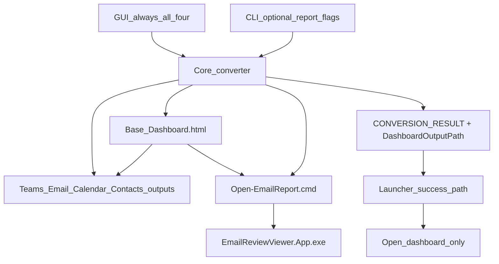

# Conversion Dashboard Landing Page — Design

**Date:** 2026-07-31
**Branch:** `experiment/next-phase` (from `master` at `36d7f0e`)
**Status:** Approved for implementation

## Problem

A successful conversion currently opens up to three HTML reports in the browser plus the Email
Reviewer, so the reviewer starts with four disconnected windows and no single place that describes
what the run produced.

## Goal

Produce one landing page per conversion that summarizes every report and links out to them, and open
only that page after a successful run.

## Decisions

| Decision | Choice |
|---|---|
| What opens after success | Dashboard only |
| Dashboard content | High-level summary per report plus an Open action; no previews or embedded report data |
| Dashboard location | Generated HTML file beside the reports: `<Base>_Dashboard.html` |
| Email open action | Generated sibling helper `Open-EmailReport.cmd` that starts Email Reviewer with the `.db` |
| Ownership | Core converter writes both new artifacts |
| GUI report selection | Removed; the GUI always runs all four reports |
| CLI report selection | `-TeamsReport` / `-EmailReport` / `-CalendarReport` / `-ContactsReport` remain for automation |

A browser page cannot launch `EmailReviewViewer.App.exe` directly, which is why the Email card points
at a generated `.cmd` helper instead of the `.db` file.

## Architecture

## Components

### Dashboard writer (core)

`Write-DashboardHtmlReport` runs after the per-report writers and before the `ReportWritten` stage.
It receives the PST item, the produced report descriptors, and the run statistics, then writes
`<Base>_Dashboard.html`.

Page contents:

- Run header: PST name, generated timestamp, total items exported, folders scanned, item and
  attachment read-warning counts.
- One card per produced report: report name, exported item count, output file name, log file name,
  and an Open link.
  - Teams, Calendar, and Contacts link to the sibling HTML file.
  - Email links to `Open-EmailReport.cmd`.
- Reports that were not produced are omitted rather than shown as empty or failed.

All dynamic values are HTML-encoded with the existing `ConvertTo-HtmlEncodedText` helper.

### Email launch helper (core)

`Open-EmailReport.cmd` is written beside the reports only when the Email report is produced. It
resolves the viewer using the same candidate order as the core `Resolve-EmailViewerPath`, starts it
with the `.db` path, and on failure prints the searched locations and pauses so the message is
readable when launched from Explorer or a browser download prompt.

### Path naming (core)

The dashboard path is derived inside the core from the display base name. `Get-ReportOutputPaths`
is unchanged so the core/launcher mirror pair enforced by `build.ps1` does not gain a new field.
`Get-ReportPathBaseName` additionally strips a trailing `_Dashboard` so pointing a later run at a
dashboard file does not produce `..._Dashboard_Dashboard`.

### Stdout contract

`CONVERSION_RESULT` gains a trailing `DashboardOutputPath=` field. All existing fields keep their
names and order.

### Launcher

- The four report checkboxes, their change handlers, enable/disable wiring, and "no report selected"
  guards are removed. A static label states that all four reports are generated. All four report
  flags are passed as true.
- The success path opens only the dashboard, taken from `DashboardOutputPath`, falling back to
  `<Base>_Dashboard.html` derived from the output box when the field is missing.
  `Assert-SelectedConversionArtifacts` still validates every typed report and log path.
- The completion dialog says the dashboard opened and lists the reports it links to.
- **Open Report** opens the dashboard when it exists and otherwise falls back to current behavior.

## Error handling

- A failed or incomplete conversion opens nothing, matching current behavior.
- A dashboard write failure is fatal to the run the same way other report-writer failures are, so the
  launcher never reports success without the landing page.
- If the dashboard cannot be opened, the launcher reports a launch warning and keeps the conversion
  result valid, as it does today for individual reports.
- If the Email helper cannot find the viewer, it reports the searched paths; the `.db` remains valid
  and can be opened from Email Reviewer directly.

## Testing

- `tests/DashboardReport.Tests.ps1`: dashboard is written for sample data with one card per produced
  report and correct counts, hostile values are HTML-encoded, cards are omitted for reports not
  produced in a CLI subset run, and `Open-EmailReport.cmd` is emitted only when Email is produced.
- `tests/StdoutContract.Tests.ps1`: `DashboardOutputPath` is present and points at an existing file.
- `tests/ReportLaunching.Tests.ps1`: the success path opens only the dashboard and the GUI passes all
  four report flags as true.
- Sample smoke: `-NoGui -UseSampleData` still reports `ItemsExported=6` with the same typed per-report
  counts, plus the dashboard artifact.

## Out of scope

- Dashboard previews or embedded report data.
- Changes to the Teams, Email, Calendar, or Contacts report internals.
- Version bump or packaging until the phase is kept.
