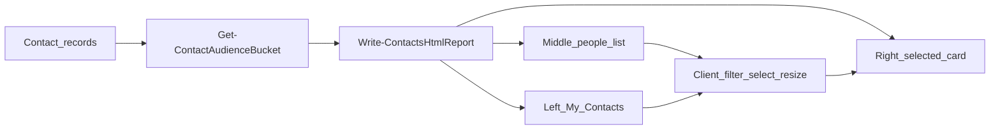

# Contacts Outlook People List — Design

**Date:** 2026-08-21
**Status:** Approved for implementation (Patrick, visual companion)

## Problem

The Contacts HTML report dumps every field into a card list with PST-folder and
Outlook-category dropdowns. Reviewers need a normal Outlook People view: folders
on the left, a scannable name list in the middle, and one contact card on the
right.

## Goal

Render `Base_Contacts.html` as a high-contrast Outlook-style three-pane People
view, grouped Internal / External / Schools, with resizable columns.

## Decisions

| Decision | Choice |
|---|---|
| Layout | Outlook People: folders \| people list \| contact card |
| Folder labels (left, this order) | Internal, External, Schools |
| Classification | Email1/Email2/Email3 domains; Internal first |
| Internal | Domain is `perfectionlearning.com` or ends with `.perfectionlearning.com` |
| Schools | Else domain is `edu` or ends with `.edu` |
| External | Else, including no email |
| Membership | One group only |
| Contrast | Dark text on white; not faint wireframe mockups |
| Columns | Drag splitters between all three panes; persist widths in localStorage |
| Search | Text search of the current folder's list |
| Dropped from primary UI | PST folder dropdown, Outlook category dropdown |
| Sample contract | Unchanged: one sample contact still counts as External |

## Architecture

Classification is computed when writing HTML (`data-audience` on each row).
The browser only filters and selects; it does not reclassify.

## Components

### Audience helper (core)

`Get-ContactAudienceBucket` inspects Email1, then Email2, then Email3 as a set.
Any Internal address wins over `.edu`. Display-name wrappers such as
`Pat <user@iowa.edu>` still yield the domain after `@`.

### Contacts writer (core)

`Write-ContactsHtmlReport` keeps the same record fields and HTML encoding.
The page becomes:

- Thin title bar with PST name and generated time.
- Left: **My Contacts** with Internal / External / Schools and counts.
- Middle: search box; rows with circular initials avatar, name, company, email.
- Right: selected contact — large initials, name, company/title, email, phone,
  notes, then the remaining exported fields (including distribution-list members,
  attachments, message class, entry ID).
- Two resize handles. Widths persist under
  `purviewContactsReport.folderPaneWidth` and
  `purviewContactsReport.listPaneWidth`.

Default folder is the first group in display order that has contacts.
Selecting a folder filters the middle list and selects the first visible row.
Empty fields, empty notes, empty distribution-list and attachment sections are omitted from the card instead of showing `(none)`.

### Out of scope

- Saving attachments to a folder
- Version bump or packaged EXEs unless Patrick asks
- Changing the six-item sample export counts
